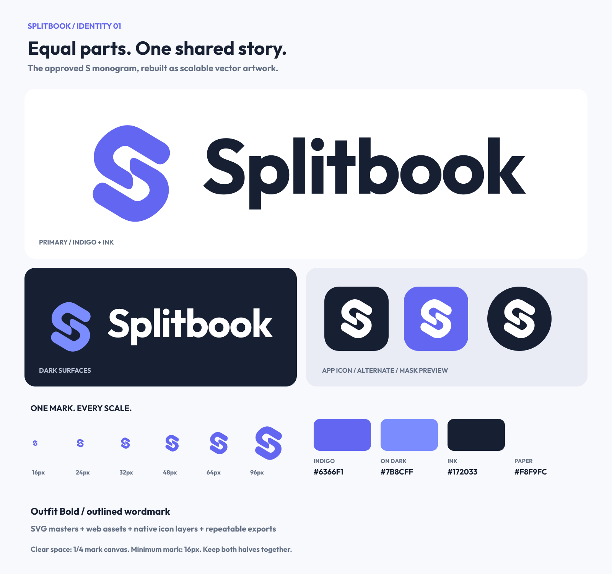

# Splitbook brand standard

Version 1.0 · 1 October 2026 · Equal share

The owner selected the [Equal share concept](../logo-concepts/2026-10-01/02-equal-share.png). The production artwork is a deliberate vector reconstruction of that concept: two matching rounded forms, rotated 180 degrees, creating an S and a continuous central gap. It is not a bitmap embedded in an SVG. The outlined wordmark uses the project's existing Outfit family, with optical spacing fixed by the generator.



## Choose an asset

All paths below are relative to the repository root. Generated files come from the sources in `assets/brand/`; update those sources and regenerate to keep every copy consistent.

| Use                                         | Asset                                                              | Standard display                          |
| ------------------------------------------- | ------------------------------------------------------------------ | ----------------------------------------- |
| Website header, light surface               | `assets/brand/svg/logo-light.svg`                                  | 32 px high; compact 24 px; large 40–48 px |
| Website header, dark surface                | `assets/brand/svg/logo-dark.svg`                                   | Same dimensions as light                  |
| Tight navigation, loading UI                | `assets/brand/svg/mark-indigo.svg` or `mark-on-dark.svg`           | 24, 32, 40 or 48 px                       |
| Large centered branding                     | `assets/brand/svg/stacked-light.svg` or `stacked-dark.svg`         | At least 200 px wide                      |
| Single-color print or restricted palette    | `logo-ink.svg`, `logo-white.svg`, `mark-ink.svg`, `mark-white.svg` | Select for background contrast            |
| Existing symbol alongside separate logotype | `assets/brand/svg/wordmark-light.svg` or `wordmark-dark.svg`       | At least 16 px high                       |
| Browser tabs                                | `apps/web/public/brand/favicon.svg` and `favicon.ico`              | ICO contains 16, 32 and 48 px             |
| Apple touch icon                            | `apps/web/public/brand/icon-180.png`                               | 180 × 180                                 |
| Web manifest, ordinary icons                | `apps/web/public/brand/icon-192.png`, `icon-512.png`               | 192 and 512 px                            |
| Web manifest, maskable icons                | `assets/brand/png/maskable-192.png`, `maskable-512.png`            | Use only with `purpose: "maskable"`       |
| Native app / iOS base / store artwork       | `apps/mobile/assets/brand/app-icon.png`                            | 1024 × 1024, RGB, fully opaque            |
| Android adaptive foreground                 | `apps/mobile/assets/brand/android-foreground.png`                  | 1024 × 1024 with transparent padding      |
| Android themed icon                         | `apps/mobile/assets/brand/android-monochrome.png`                  | Same geometry, black alpha mask           |
| Native splash, light and dark               | `apps/mobile/assets/brand/splash-light.png`, `splash-dark.png`     | 1152 × 1152 = the 288 dp splash icon @4x  |

The primary app icon is white on Ink. The indigo app-icon SVG is an alternate for marketing; keep a release's launcher identity consistent. Rounded corners on the overview are mask previews. Native upload files are full squares; the operating system supplies its mask.

## Identity rules

**Geometry.** Scale the complete SVG proportionally. Both halves retain their spacing and orientation. Use the existing filled paths rather than recreating an S with a font, redrawing it with strokes, or generating another image. Generated logos contain paths only and need no installed font, linked image or remote resource.

**Clear space.** A standalone mark needs free space equal to 25% of its displayed 512-unit canvas on every side, outside the SVG box. A horizontal lockup needs half its displayed height around it. Icon tiles use their generated internal padding instead of this external-spacing rule. The master viewBox's small internal margin is not a substitute for layout clear space.

**Minimum size.** Mark: 16 CSS px, with 24 px preferred in app UI. Horizontal logo: 24 CSS px high. Wordmark alone: 16 px high. Below those sizes use the favicon asset, or omit the brand from that control. Use the complete name **Splitbook**, with a capital S and lowercase b. App release-name capitalization is a separate product decision.

**Color.** The identity palette lives in `assets/brand/brand.json`: Indigo `#6366F1`, On-dark indigo `#7B8CFF`, Ink `#172033`, White `#FFFFFF`, Paper `#F8F9FC`. Use the light variant on white/paper and the dark variant on ink/dark surfaces; use white on a solid saturated or dark background. Preserve flat fills, original proportions and a clear central gap. The website's semantic UI colors still come from `packages/shared/src/design-tokens.ts`; these logo values do not replace button, text, or financial-status tokens.

**Typography.** The fixed logo uses outlined Outfit Bold (700), with tracking specified by `brand.json`. Use the generated wordmark as artwork instead of recreating it as live text. Product UI continues to use Outfit, with IBM Plex Mono for money. The bundled font is licensed under the SIL Open Font License; retain `source/OFL.txt` when redistributing its font source.

**Accessibility.** An image link that is the only home label should have `alt="Splitbook home"`. A non-link logo can use `alt="Splitbook"`. A mark beside an equivalent visible name is decorative: `alt=""`, or `aria-hidden="true"` for inline SVG. Provide the accessible name on the parent when SVG is decorative. Financial status colors and icons remain separate from the brand mark.

## Generate standard or custom sizes

Run from the repository root; no system font or hosted font request is needed:

```sh
npm ci --prefix tools/brand --ignore-scripts
npm run build --prefix tools/brand
npm run check --prefix tools/brand
```

The isolated tooling package has pinned dependencies and its own lockfile. It leaves the app's dependencies and build configuration alone. `brand.json` lists the standard mark, lockup, native and web sizes; `manifest.json` records exact file dimensions and SHA-256 hashes. A filename such as `logo-light-h32@2x.png` has a 64-pixel physical height and should display at 32 CSS px.

Custom exports always derive from the same source and preserve aspect ratio:

```sh
node tools/brand/generate.mjs --asset logo-light --width 1200 --out /tmp/splitbook-logo-1200.png
node tools/brand/generate.mjs --asset mark-white --width 2048 --out /tmp/splitbook-mark-2048.svg
```

Use any basename from `assets/brand/svg/` as `--asset`. Widths must be integers from 16 through 4096. Choose a new output filename; custom exports refuse to overwrite. Native submission icons must use the standard opaque RGB PNG exports rather than a custom transparent export. Raster sizes are rendered directly from SVG, never upscaled from a small PNG.

## Website integration

Ready-to-use copies are in `apps/web/public/brand/`. A header can use:

```tsx

```

Choose `logo-dark.svg` through the app's existing theme state on dark surfaces. Both SVGs have the same viewBox and intrinsic dimensions. If using Next Image, supply the SVG's actual width/height ratio rather than inventing dimensions.

For a later application integration, point Next metadata to `/brand/favicon.svg`, `/brand/favicon.ico` and `/brand/icon-180.png`. Account for the existing `apps/web/src/app/favicon.ico` file-convention asset so it does not override the intended favicon. If using maskable PWA icons, copy the generated maskable assets into `public/brand` and give them a separate manifest entry with `purpose: "maskable"`.

## Mobile integration

The prepared PNGs live in `apps/mobile/assets/brand/`. Merge these fields into the existing Expo configuration while preserving identifiers, intent filters, plugins and environment behavior:

```ts
icon: './assets/brand/app-icon.png',
android: {
  // Preserve the existing android fields.
  adaptiveIcon: {
    foregroundImage: './assets/brand/android-foreground.png',
    monochromeImage: './assets/brand/android-monochrome.png',
    backgroundColor: '#172033',
  },
},
plugins: [
  // Preserve the existing plugins.
  [
    'expo-splash-screen',
    {
      image: './assets/brand/splash-light.png',
      imageWidth: 288,
      backgroundColor: '#F8F9FC',
      dark: { image: './assets/brand/splash-dark.png', backgroundColor: '#172033' },
    },
  ],
],
```

The splash uses the loading-UI marks: Indigo on Paper in light, On-dark indigo on Ink in dark. Each splash PNG is the whole 288 dp canvas Android 12+ gives the splash icon, with the 128 dp mark inside the central 192 dp circle that Android keeps. That is why `imageWidth` is 288, not the mark's width. The splash follows the system light/dark setting, because it shows before the app can read its own appearance preference.

For logos inside React Native screens, use an existing SVG rendering setup if present, or import a generated PNG and set its display dimensions explicitly with `resizeMode="contain"`. A raw SVG file is not automatically a React Native component. Launcher-icon changes require rebuilding the native binary; this kit does not itself update an installed app or an App Store listing.

The adaptive foreground is centered inside Android's circular 66/108 safe region, the splash mark inside the splash's 192/288 circle, and the export tool checks both pixel by pixel. The maskable web icon uses its own larger safe region. Keep those assets separate: their padding serves different platform masks. Platform references: [Expo icon configuration](https://docs.expo.dev/develop/user-interface/splash-screen-and-app-icon/), [Android adaptive icon guidance](https://developer.android.com/develop/ui/compose/system/icon_design_adaptive), [Apple app icon configuration](https://developer.apple.com/documentation/xcode/configuring-your-app-icon).

## Agent workflow and completion

1. Choose the asset and platform from the table. Done when the variant, displayed size and background are explicit.
2. Use the existing SVG or standard PNG. For another size, run the exporter. Change the mark geometry only for an explicit identity redesign; change export sizes through `brand.json`. Done when every delivery file comes from the canonical sources.
3. Run `npm run check --prefix tools/brand`. Done when generated copies match, app icon opacity passes and Android safe-zone checks pass.
4. Open `brand-board.png`, inspect the actual target size on light/dark backgrounds, and verify the platform mask in the target application when integrating. Done when the small S gap stays visible and the wordmark is not stretched, clipped or substituted.
5. Report the delivered paths and any app integration or native-device verification still pending. A generated file is ready for integration; it is not evidence of a deployed website or installed launcher icon.

## Verification for this kit

The export run checks reproducibility, path-only self-contained SVGs, native opacity and Android's circular safe zone. The overview is rendered from those vectors and visually inspected at large and small sizes. No application source, launcher configuration, live site, or store listing was changed as part of creating the kit. Device/launcher verification belongs to the integration step.

Recorded checks on 1 October 2026: 144 generated files matched a repeat export; 22 canonical SVGs parsed and 103 PNGs decoded; ICO entries were 16/32/48 px; the 1024 px native icon was RGB without alpha. The mark retained two separate forms at 16/24/32/48 px. Custom 997 px PNG and 2048 px SVG exports passed; attempting to overwrite the custom export was rejected as intended. Android foreground/monochrome nontransparent pixels fit the circular safe region. The final brand board was visually reviewed.
