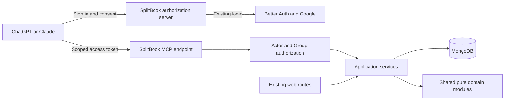

# SplitBook integration with ChatGPT and Claude

Research date: 30 September 2026. Status: proposed implementation plan; no application changes or deployment performed.

Build one authenticated remote MCP server so people can use their own SplitBook account from ChatGPT and Claude. The user selected balances and spending followed by expense drafts for review as the first-version scope. Direct ledger writes from chat remain a later option. The architecture below is proposed; it assumes the intended product is SplitBook and the audience initially consists of its existing beta users.

## Current technology choice

The latest stable protocol baseline verified in the official SDK documentation is **MCP 2026-07-28**, implemented by the **TypeScript SDK v2**. Use `@modelcontextprotocol/server`; the older monolithic `@modelcontextprotocol/sdk` examples belong to v1. Pin an exact stable package version after checking registry availability and peer dependencies during implementation; this research does not establish an exact latest patch. [Official SDK](https://ts.sdk.modelcontextprotocol.io/v2/)

The modern protocol uses stateless requests and `server/discover`, replacing the older initialization/session model. SDK v2 can also serve legacy clients. Target the modern revision and test both consumer products before rejecting older traffic. Do not confuse the SDK major version with the date-based protocol version. [Protocol versions](https://ts.sdk.modelcontextprotocol.io/v2/protocol-versions)

Current OpenAI documentation packages MCP integrations as **plugins**, with custom UI optional. Developer-mode testing and public directory distribution are separate workflows. Anthropic also now supports submitting remote MCP connectors or plugin bundles. These platform packages are distribution layers around the same server, not replacements for MCP. [OpenAI quickstart](https://developers.openai.com/plugins/quickstart), [Claude plugin announcement](https://claude.com/blog/build-plugins-for-claude)

## Product experience

The proposed user journey is:

1. Open SplitBook Settings → AI connections and choose ChatGPT or Claude.
2. Follow the platform's installation instructions, initially adding the hosted server URL manually.
3. Sign in through SplitBook and grant the connection access to selected Groups and capabilities.
4. Ask questions such as “Who do I owe in our Goa trip?” or “What did our Household spend on groceries in September?”
5. Later, request “Prepare an INR 1,200 dinner expense, paid by me, split equally between Alex and Sam.” Review the resolved Group, payer, participants, date, Tag, currency and split before saving.
6. Inspect and revoke connections from SplitBook.

The manual setup and Settings page above are proposed product work. Do not ship a “Connect” button implying one-click installation until each platform's supported install flow has been tested.

Balances are running positions, not monthly balances. A Month filters spending in the viewer's timezone. A Settlement records a payment that already happened; it does not send money. These definitions come from `CONTEXT.md` and must appear consistently in tool descriptions and results.

## Alternatives

| Approach | Fit for this goal | Recommendation |
| --- | --- | --- |
| Remote MCP with OAuth | One tool interface for both assistants, live authorized data | Primary integration |
| MCP Apps UI | Expense review cards, forms and balance views inside compatible hosts | Add after basic tools work; keep text fallback |
| Custom GPT Actions | OpenAI-specific REST integration through a custom GPT | Avoid as the primary cross-platform contract |
| AI assistant inside SplitBook | Full control of onboarding and UI, but a separate assistant product to build and operate | Reconsider if external-platform setup blocks adoption |
| CSV export and upload | Simple snapshot analysis, but stale data and no live write path | Possible lightweight fallback |

These rankings are product judgments. GPT Actions expose REST operations to custom GPTs; MCP Apps supply an embedded UI bridge and are not a different backend protocol. [GPT Actions](https://developers.openai.com/api/docs/actions/introduction), [OpenAI MCP UI](https://developers.openai.com/plugins/build/chatgpt-ui)

## Architecture

Proposed first deployment: a Node-runtime endpoint in the existing `apps/web` application, for example `/api/mcp`. This keeps the current server services directly reusable. Start with request-scoped work; validate hosting timeouts and transport behavior during the spike. There is no demonstrated need for another deployment or a Redis transport-session store for the initial tools.

Suggested organization:

- `apps/web/src/app/api/mcp/route.ts`: transport and authenticated request context.
- `apps/web/src/lib/mcp/`: schemas, tool registration, result projection and host-neutral errors.
- `apps/web/src/lib/application/`: proposed actor-aware operations shared by HTTP routes and MCP, extracting only what the chosen tools need.
- Existing `src/lib/services/`: persistence and domain workflows.
- `packages/shared`: continue to hold only pure types, validators and domain logic. No auth, MongoDB or MCP server imports.

If independent scaling later warrants `apps/mcp`, first extract reusable server application logic into a separate server-only package. Do not import Next application internals across applications or move server dependencies into `@splitbook/shared`.

## Authentication and permissions

The repository already pins Better Auth 1.7.3, but its configured plugins currently provide browser authentication, not delegated MCP authorization. Google signing someone into SplitBook and SplitBook authorizing ChatGPT to access their data are two separate flows.

Evaluate Better Auth's current `@better-auth/mcp` plus `@better-auth/cimd`, with its required JWT plugin. The documented integration provides OAuth resource binding and discovery; CIMD is the preferred client identity path, while DCR is an explicit compatibility option. Validate package compatibility and MongoDB schema/index requirements before changing the existing auth configuration. [Better Auth MCP](https://better-auth.com/docs/plugins/mcp)

Use authorization code with PKCE, protected-resource discovery and audience-bound tokens. ChatGPT currently prefers CIMD and still supports DCR. Never use the user's Google token, browser session cookie or a shared application API key as the connector credential. [OpenAI authentication](https://developers.openai.com/plugins/build/auth)

For Claude's CIMD flow, advertise public-client token authentication (`none`) as well as CIMD support. This means no client secret at token exchange, not anonymous access to user data. Validate the real 401 challenge, redirect URI and token exchange against both hosts. [Claude authentication](https://claude.com/docs/connectors/building/authentication)

Proposed grants: `splitbook:read`, later `splitbook:drafts:write`, and separately `splitbook:expenses:write`. Group selection is a server-side grant constraint. Effective access must be the intersection of granted Groups, current membership and tool scope. Derive the actor from verified credentials; never accept actor identity from model-supplied arguments.

Add connection records, consent, revocation and minimal audit metadata. Specify and test revocation latency, including already-issued JWTs: signature validation alone cannot make a revoked grant immediately unusable. Keep the existing Google allowlist and production demo restrictions; a connector must not bypass either. Display what Group data the assistant can receive, minimize member fields, and avoid logging full expense notes or tokens.

## Repository findings that affect implementation

These are observations from the local checkout, including its existing uncommitted changes; they are not a claim about the deployed release.

| Evidence | Consequence |
| --- | --- |
| `src/lib/auth/create-auth.ts` configures Google, demo and cookie sessions | Add delegated authorization while preserving existing login behavior |
| `src/lib/auth/proxy-rules.ts` rejects anonymous API requests based on cookies | Give only the intended MCP endpoint an exception to the cookie check; authenticate it with tokens. Verify discovery URLs separately |
| Group expense and balance routes enforce membership before service calls | Reusing services directly must retain those checks |
| `ExpenseService.create` and single-expense access also enforce membership; `getGroupExpenses` does not | Establish an explicit actor-aware boundary for every exposed operation |
| Expense GET materializes due recurring expenses | Do not label that route wrapper read-only |
| Expense creation supports request keys; updates accept expected revisions | Reuse these protections and require them in future connector writes |
| `ExpenseFormDialog` keeps its draft in component state for the dialog lifetime | A cross-device reviewable draft requires new server storage and a review page |

For read-only tools, recommend returning the saved ledger state without triggering recurring materialization, with an `asOf` timestamp and explicit saved-ledger semantics. If parity with the web requires materialization, resolve that lifecycle separately before advertising read-only behavior. The first spike must verify this policy against real recurring-expense examples.

## Initial tools

| Tool | Purpose | Proposed release |
| --- | --- | --- |
| `list_groups` | Find Groups within the current grant | Read-only beta |
| `get_group_context` | Resolve member IDs, active Tags, currency and Theme | Read-only beta |
| `get_group_balances` | Return running balances and suggested settlement amounts | Read-only beta |
| `list_expenses` | Bounded, paginated expense lookup | Read-only beta |
| `get_spending_summary` | Date-filtered spending by category or Tag | Read-only beta |
| `prepare_expense_draft` | Validate and store an unfinished entry, return a review link | Draft release |
| `commit_expense_draft` | Save a reviewed command exactly once | Later, subject to confirmation design |

Return structured data plus concise text, currency codes, exact monetary values, explicit dates/timezone, pagination and application links. Compute totals and splits in domain code, not in the model. Ask for clarification when member or Group names are ambiguous. Require an active Tag; do not silently invent one.

A stored draft is a write even though it does not affect Balances. Use honest tool annotations. For direct saves, bind confirmation to the exact draft revision and immutable command. Do not treat a model-supplied `confirmed: true` as proof of user approval. The simplest first release confirms through the authenticated SplitBook review page; native chat confirmation can follow after host-specific testing.

## Delivery sequence

1. **Compatibility spike.** Build a staging server against exact pinned stable dependencies. Verify modern discovery, OAuth consent, token refresh and one authenticated tool in both ChatGPT and Claude. Record client surface and observed protocol/auth behavior. Decide whether limited legacy transport or DCR support is needed; do not blindly copy `legacy: reject` from a modern-only example.
2. **Read-only beta.** Implement grants, connection management and the five read tools. Cover two users in disjoint Groups, membership removal, revoked grants, expired/wrong-audience tokens, pagination, currency precision, timezone boundaries and recurring-expense read semantics. Pilot with existing beta users.
3. **Draft workflow.** Add server-side draft persistence, owner/Group checks, expiry, review page and idempotent saving. Test ambiguous names, missing fields, retry after a lost response and Group changes between draft and save.
4. **Direct writes and optional UI.** Add only after confirming that users need them. Test replay protection, revision conflicts, confirmation binding and text-only fallback. Keep destructive actions and Settlement recording out of the first write release.
5. **Public distribution.** Package and submit independently to each platform, supply sample accounts and walkthroughs, and validate current review requirements. Resolve public onboarding separately from the existing beta allowlist; publishing a listing does not make unapproved SplitBook accounts usable.

ChatGPT developer mode depends on account/workspace policy. Its current connection flow uses Settings → Security and login, then the Plugins page. Public submission requires a stable public HTTPS endpoint and review materials. Do not promise universal account access or a review timeline. [Connect and test](https://developers.openai.com/plugins/deploy/connect-chatgpt), [Submission](https://developers.openai.com/plugins/deploy/submission)

## Success criteria and remaining decisions

The beta succeeds when a user can connect either assistant, obtain the same authorized saved-ledger answers as SplitBook, and revoke access without contacting support. A draft release succeeds when a user can review and save once even after a tool retry, with no unexpected Balance changes before saving.

Confirmed first-version scope: balances and spending, followed by drafts for review. Remaining product decisions: beta-only versus broader onboarding; all accessible Groups versus selected Groups by default; whether native chat UI is worth its additional validation. Recommended defaults are selected Groups, existing beta access and plain tools before embedded UI.

Cost assumption: ordinary MCP handlers need not call a model themselves; the host assistant performs reasoning. Budget for hosting, database access, auth storage, support and observability. Optional OCR or in-app AI would introduce separate provider usage. No exact cost estimate is justified until traffic and deployment requirements are measured.

See the companion [platform research](../research/2026-09-30-mcp-platform-research.md) for MCP and Claude source details. This plan is evidence-backed but has not been validated with a live connection to either host.
